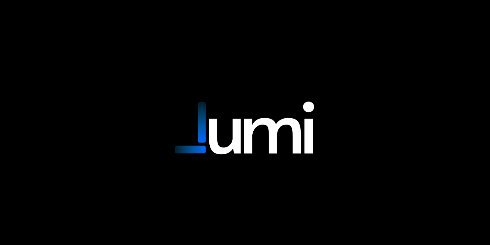

# Lumi Calls 🌙📞

  

[Lumi Calls](https://lumicalls.com) is a landing page I designed and built for an AI call agent project.  
It showcases **Lumi**, an AI that can handle calls, manage reservations, and integrate with CRMs — powered by Make.com automations.  

---

## 🚀 Live Demo
👉 [lumicalls.com](https://lumicalls.com)

  

---

## ✨ Highlights
- Responsive, modern landing page  
- Clear sectioned layout (hero, inbound/outbound, integrations)  
- Smooth animations & clean UI  
- Deployed with performance and accessibility in mind  

---

## 👨‍💻 Author
Built with ❤️ by [Nasser Tadili](https://github.com/ntadili)
